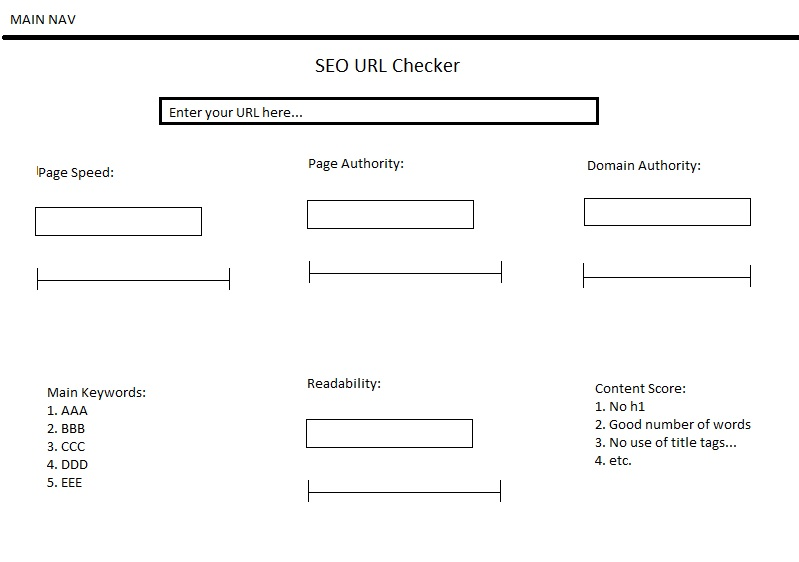

# SEO URL-Checker – SEO Data Dashboard
The “SEO URL-Checker” is an online tool into which small and medium sized business owners can type their URL and get important SEO (Search Engine Optimization) statistics concerning their own as well as competitor’s websites. While the fully developed version will eventually tie into an SEO API (MOZ API), the version at hand is a proof of concept that relies on an internal database. 

## UX
The purpose of SEO URL-Checker is to inform users about the competitiveness of their website in terms of metrics that are important for ranking highly in search engines like Google and Yandex. 

The page is for any individual or company worldwide who would like to assess the SEO competitiveness of their website. 

SEO URL-Checker is the best way to assess SEO competitiveness of websites because it gives a quick and comprehensive overview of the most important statistics that impact a website’s search engine rankings. 
- As a user type, I want to get a quick overview of important statistics that affect my website’s SEO
- As a user type, I want to be able to compare my website’s SEO metrics to that of competitors.

### Mockup

## Features
SEO URL-Checker has various features that intend to inform users about statistics that are important for their website’s SEO as well as how these statistics compare to competitor pages. 

### Existing Features
- HTML Structure – the tool is contained within the structure of an HTML webpage (head, header, body, footer) allowing users to easily access it from anywhere in the world. For the purpose of data display, javascript and CSS is relied upon. 
- Website Selector - allows users to select one or multiple websites for which they want to review data. 
- Data Table – Allows users to see if their websites are online (“Response Code”) and how spammy they are considered to be in the eyes of search engines (“Spam Score”).
- Charts – Show users a number of visualisations concerning the most important statistics for SEO (“Page Authority”, “Domain Authority”, “Spam Score”, “Links”, “Equity Links”, “MOZ Rank”). All charts are ordered and coloured in such a way that each website has the same colour and appears in the same order across all charts.
- Chart Headings & Descriptions – Each chart has a heading above it and description underneath it, highlighting and explaining the respective metric that is displayed for the pages.

All features are fully responsive on mobile devices (incl. tablets and smartphones). 

### Features Left to Implement
- Inputting websites manually via webform (vs. website selector)
- API connectivity (vs. reliance on csv data sheet)

## Technologies Used
In this section, you should mention all of the languages, frameworks, libraries, and any other tools that you have used to construct this project. For each, provide its name, a link to its official site and a short sentence of why it was used.

- [HTML](https://developer.mozilla.org/en-US/docs/Web/HTML)
    - The project uses HTML to allow structuring and display of the information presented via MarketingMan.ie.
- [CSS](https://developer.mozilla.org/en-US/docs/Web/CSS)
    - The project uses CSS to visually design the data that is being transmitted via HTML.
- [Bootstrap](https://getbootstrap.com/docs/3.3/)
    - The project uses the Bootstrap framework (v. 3.3.7) to save time in development by relying on standardized HTML and CSS elements that can be found in the library.
- [JavaScript](https://developer.mozilla.org/en-US/docs/Web/JavaScript)
    - The logic for the rendering graphs is written in javascript coding language.
- [D3](https://d3js.org/) & [DC](https://dc-js.github.io/dc.js/)
    - The project uses the D3 and DC JavaScript libraries for the purpose of being able to write the logic for visualising the SEO data on the site more easily.
- [Crossfilter](https://github.com/crossfilter/crossfilter)
    - The JavaScript library "Crossfilter" is used for grouping of data do that different charts can be compared based on results for selected data entries.

## Testing

1.	Quick overview of important SEO data for one website
    1.	Go to SEO URL-Checker page
    2.	Try to scroll down to “Enter your URL here”, select individual page and verify that data display of all charts only shows data for the selected page.
    3.	OR try to scroll down to “Enter your URL here”, select "AlL", click on single bar/pie slice in charts and verify that data display of all charts only displays results for the page that was clicked on.

Manual testing revealed that the data for individual websites was integrated and visualised seamlessly, whereby giving an efficient overview of important SEO data for one page. The page as a whole is accessible on all devices and all major browsers and looks virtually the same on different browsers. 

2.	Comparing of SEO Data for multiple websites
    1. Go to SEO URL-Checker page
    2. Try to select "All" websites and verify that charts are displaying correctly for all websites.
    3. OR try to scroll down to “Enter your URL here”, select "All", click on multiple bar/pie slice in charts (e.g. a.com & b.com) and verify that data display of all charts only displays results for the pages that were clicked on.

Manual testing revealed that the data for comparing multiple websites was integrated and visualised seamlessly, whereby giving an efficient overview of important SEO data for one page and enabling the user to compare his page to others. The page as a whole is accessible on all devices and all major browsers and looks virtually the same on different Browsers. 

## Deployment
Uploaded project to github repository by using commands:

- git remote add origin https://github.com/Siminic87/interactive-frontend-milestone-final.git

Followed by:

- git push -u origin master

in Cloud9's command line interface. Was then asked to enter username and password to confirm. Project now stored here: [https://github.com/Siminic87/interactive-frontend-milestone-final.git](https://github.com/Siminic87/interactive-frontend-milestone-final.git)

To run locally: [GitHub Pages](https://siminic87.github.io/interactive-frontend-milestone-final/)

## Credits
### Data Charts
- Advice for adapting colouring and ordering of data charts from various pages of [stackoverflow.com](https://stackoverflow.com)